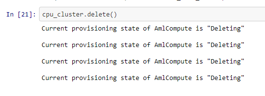

# Optimizing an ML Pipeline in Azure

## Overview
<br>

This project is part of the Udacity Azure ML Nanodegree.
In this project, we build and optimize an Azure ML pipeline using the Python SDK and a provided Scikit-learn model.
This model is then compared to an Azure AutoML run.

## Summary
<br>

This dataset contains data about direct marketing campaings (phone calls) of a portuguese banking institution. We seek to predict if the client will suscribe a term deposit (variable y).

[Dataset source](https://archive.ics.uci.edu/ml/datasets/bank+marketing)

For this problem the best performing model was a voting ensemble model, with an accuracy of 0.9475, most probably because of the flexibility of its decision boundaries using different participating models in the ensemble.

## Scikit-learn Pipeline
<br>

The pipeline architecture for the dataset transforms categorical features with two categories to binary and with more than two variables replaces the column with an equivalent of dummy variables. The model implemented is a logistic regression with a fixed *l2* regularization and hyperparameters *C* (inverse regularization strength) and *max_iter* (max number of iterations) for hyperparameter tuning.

For the parameter space search a random parameter sampler was used with *C* and *max_iter*, uniform (0.05, 0.1) and choice (100, 150, 200, 250, 300) samplers were selected respectively.
The benefits for these parameter samplers is that makes easier the sampling mechanism to select the hyperparameter's values. In the case of the *C* hyperparameter only the min-max limits have to be chosen, the sampler will explore that space inbetween. In the case of *max_iter*, one specific set of values can be passed and the sampler will randomly select one of them.

Using the bandit policy any model which metric falls above the top 10% will be stopped to not waste resources.

## AutoML
<br>

In contrast one thing that AutoML does in addition to select the most appropiate hyperparameters is selecting different kinds of feature transformations and models. Sometimes there exist a better performing model than the one we have in mind to achieve a better performance metric.

To use an autoML instance some configuration argument are needed.

```python
 automl_config = AutoMLConfig(
    experiment_timeout_minutes=30,
    task='classification',
    primary_metric='AUC_weighted',
    compute_target=compute_target,
    training_data=training_dataset,
    label_column_name="y",
    n_cross_validations=2)
```

Where:
- **experiment_timeout_minutes** determines the max time for the autoML task to complete in minutes.
- **task** is the desired task to be accomplished. It can be 'classification', 'regression' or 'forecast'.
- **primary_metric** is the metric that will be compared in the model / hyperparameter optimization.
- **compute_target** is the compute resources intended to be used to complete the experiment task. If none is given, it is assume that the experiment will be used over local resources.
- **training_data** is the dataset provided to the experiment to fit such models.
- **label_column_name** refers to the target column used for the task to be predicted
- **n_cross_validations** is used to refer the number of folds in order to perform [n cross fold validation](https://en.wikipedia.org/wiki/Cross-validation_(statistics)).

## Pipeline comparison
<br>

### Performance

The accuracy for the logistic regression and the ensemble model were .9156 and .9475 respectively, giving the lead to the latter.

### Architecture

This section compares between the 2 models obtained in this project. It is worth mention the same data preprocess from the *clean_data* function was applied for both models.

#### Logistic regression architecture

The first approach was obtained using the azure ML tool hyperdrive, a tool used for hyperparameter optimization. For this experiment a fixed [*LogisticRegression*](https://scikit-learn.org/stable/modules/generated/sklearn.linear_model.LogisticRegression.html) model was applied, using hyperdrive to search over the *C* and *max_iter* hyperparameters.

```
['--C', '0.09213114549724909', '--max_iter', '100']
```

For the output above, the best parameters found for the experiment were a *C* of ~0.09 and a *max_iter* of 100. A recommendation to tune even further these values is to run another hyper parameter search in the neighbourhood around these values; Maybe A even better values can be found doing this.

#### AutoML architecture

 The architecture for both models is in principle different: logistic regression uses a *dimension-1* decision hyperplane passed through a logistic function to separate one class versus the other, in contrast the voting ensemble uses several different models with probably different decision function finding mechanisms in order to average them and include them to the ensemble to emit a vote over some observation. some really interesting difference between each one is the intepretability the voting ensemble has to lose in order to (most often than not) increase the evaluation metric.

```python
[('datatransformer',
  DataTransformer(enable_dnn=None, enable_feature_sweeping=None,
                  feature_sweeping_config=None, feature_sweeping_timeout=None,
                  featurization_config=None, force_text_dnn=None,
                  is_cross_validation=None, is_onnx_compatible=None, logger=None,
                  observer=None, task=None, working_dir=None)),
 ('prefittedsoftvotingclassifier',
  PreFittedSoftVotingClassifier(classification_labels=None,
                                estimators=[('0',
                                             Pipeline(memory=None,
                                                      steps=[('maxabsscaler',
                                                              MaxAbsScaler(copy=True)),
                                                             ('lightgbmclassifier',
                                                              LightGBMClassifier(boosting_type='gbdt',
                                                                                 class_weight=None,
                                                                                 colsample_bytree=1.0,
                                                                                 importance_type='split',
                                                                                 learning_rate=0.1,
                                                                                 max_depth=-1,
                                                                                 min_child_samples=20,
                                                                                 min_child_weight=0.001,
                                                                                 min_spl...
                                                                                objective='reg:logistic',
                                                                                random_state=0,
                                                                                reg_alpha=1.1458333333333335,
                                                                                reg_lambda=1.3541666666666667,
                                                                                scale_pos_weight=1,
                                                                                seed=None,
                                                                                silent=None,
                                                                                subsample=0.6,
                                                                                tree_method='auto',
                                                                                verbose=-10,
                                                                                verbosity=0))],
                                                      verbose=False))],
                                flatten_transform=None,
                                weights=[0.3333333333333333, 0.3333333333333333,
                                         0.13333333333333333, 0.06666666666666667,
                                         0.06666666666666667,
                                         0.06666666666666667]))]
```

The code from above corresponds to the architecture of the best model found by automl. *DataTransformer* class transforms the data type that better suits for use to the model. The winning model is defined as a *Pipeline* where first the data input is preprocessed with the scikit learn [*MaxAbsScaler*](https://scikit-learn.org/stable/modules/generated/sklearn.preprocessing.MaxAbsScaler.html) to after be given to a [*LightGBMClassifier*](https://lightgbm.readthedocs.io/en/latest/pythonapi/lightgbm.LGBMClassifier.html) with the best hyper parameters obtained so far.

It is worth noting that autoML also noticed potential problem. The class number are umbalances which can lead to the model to favor the most frequent class.

```
****************************************************************************************************
DATA GUARDRAILS: 

TYPE:         Class balancing detection
STATUS:       ALERTED
DESCRIPTION:  To decrease model bias, please cancel the current run and fix balancing problem.
              Learn more about imbalanced data: https://aka.ms/AutomatedMLImbalancedData
DETAILS:      Imbalanced data can lead to a falsely perceived positive effect of a model's accuracy because the input data has bias towards one class.
+---------------------------------+---------------------------------+--------------------------------------+
|Size of the smallest class       |Name/Label of the smallest class |Number of samples in the training data|
+=================================+=================================+======================================+
|3329                             |1                                |29655                                 |
+---------------------------------+---------------------------------+--------------------------------------+

****************************************************************************************************
```

## Future work
<br>

Azureml is an in-development library and some models are not implemented yet (catboost for example). Including more models to this experimentation process could find an even better model to achieve better results. Also, in the case of logistic regression there was no action taken to tackle the class imbalance issue which could be affecting the model's intended objective. This issue can be solve in different ways: applyinng undersampling, oversampling or just using the LogisticRegression *class_weight* parameter to 'balanced'.

## Proof of cluster clean up
<br>

The proof of cluster deletion is denoted on the output of the last cell on this notebook.



## References
<br>

- [ModuleNotFoundError: No module named 'sklearn'](https://knowledge.udacity.com/questions/423888)
- [I get error while saving AutoML model](https://knowledge.udacity.com/questions/384083)
- [AutoML submit getting IncompatibleOrMissingDependency exception](https://knowledge.udacity.com/questions/374305)
- [Hyperdrive tutorial](https://docs.microsoft.com/en-us/azure/machine-learning/how-to-tune-hyperparameters)
- [Understanding automated ML](https://docs.microsoft.com/en-us/azure/machine-learning/how-to-understand-automated-ml)